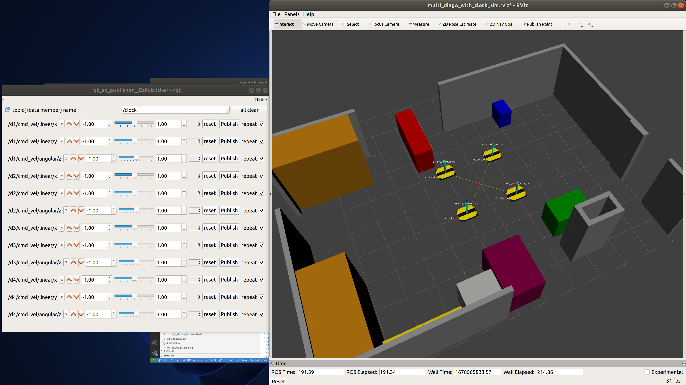

# Swarm Project - 2
This is a repository for ARM Swarm Project 2 that utilizes four omnidirectional Clearpath Dingo Robots.

Clearpath Dingo all repositories:  
https://github.com/dingo-cpr

Clearpath Dingo all documents:  
https://docs.clearpathrobotics.com/docs/robots/indoor_robots/dingo/user_manual_dingo/

# The Devices In The Lab:

| Description                               | Username      | Hostname (Computer Name) | MAC Address       | IP            | Password  | OS           | ROS     |
| ---                                       | ---           | ---                      | ---               | ---           | ---       | ---          | ---     |
| Workstation 1 Tablet (Mega Stitch)        | tablet-ws1    | tablet20-ws1             | F4:6D:3F:EC:8B:4B | 192.168.1.96  | 1234      | Ubuntu 20.04 | Noetic  |
| Workstation 2 Tablet (RF Welder)          | tablet-ws2    | tablet20-ws2             | F4:6D:3F:EC:7C:5F | 192.168.1.97  | 1234      | Ubuntu 20.04 | Noetic  |
| Workstation 3 Tablet (Short Arm Sewing)   | tablet-ws3    | tablet20-ws3             | F4:6D:3F:EC:7B:C4 | 192.168.1.98  | 1234      | Ubuntu 20.04 | Noetic  |
| Workstation 4 Tablet (Inspection/Loading) | tablet        | tablet20                 | AC:67:5D:5B:0F:86 | 192.168.1.99  | 1234      | Ubuntu 20.04 | Noetic  |
| Main Computer                             | razer         | razer20                  | 3C:8C:F8:EB:11:86 | 192.168.1.100 | 1234      | Ubuntu 20.04 | Noetic  |
| Dingo-omni 1                              | administrator | cpr-do100-10000050       | 0C:7A:15:CB:A6:0B | 192.168.1.101 | clearpath | Ubuntu 20.04 | Noetic  |
| Dingo-omni 2                              | administrator | cpr-do100-10000051       | F0:B6:1E:B7:29:1F | 192.168.1.102 | clearpath | Ubuntu 20.04 | Noetic  |
| Dingo-omni 3                              | administrator | cpr-do100-10000052       | 8C:1D:96:5B:BB:66 | 192.168.1.103 | clearpath | Ubuntu 20.04 | Noetic  |
| Dingo-omni 4                              | administrator | cpr-do100-10000053       | 8C:17:59:E5:C8:5B | 192.168.1.104 | clearpath | Ubuntu 20.04 | Noetic  |

# Setting up the system


<details> 
    <summary>Click to expand</summary>

## Install some dependencies of Dingo Gazebo Simulation and Others

``` bash
# CUSTOM RELATED
sudo apt-get install -y sshpass;

sudo apt-get install -y ros-noetic-rqt-ez-publisher;
sudo apt-get install -y spacenavd;
sudo apt-get install -y ros-noetic-spacenav-node;
sudo apt-get install -y ros-noetic-tf2-sensor-msgs;
sudo apt-get install -y ros-noetic-imu-tools;
sudo apt-get install -y ros-noetic-imu-pipeline; # for imu_transformer
sudo apt-get install -y ros-noetic-navigation; # for navigation stack
sudo apt-get install -y ros-noetic-visualization-tutorials; # rviz python bindings.

# PYTHON RELATED
sudo apt-get install -y python3-pip;
pip3 install pyserial;
pip3 install quadprog;
pip3 install pandas;
pip3 install pygame;
pip3 install scipy;
pip3 install numpy==1.21; # needed to resolve the issue "AttributeError: module 'numpy' has no attribute 'typeDict'"
pip3 install shapely; # needed to calculate the swarm footprint polygon and costmap parameter updater functions
pip3 install matplotlib==3.7.3;
pip3 install ortools==9.7.2996;

# DINGO RELATED
sudo apt-get install -y ros-noetic-dingo-desktop;

sudo apt-get install -y ros-noetic-dingo-simulator;

sudo apt install ros-noetic-dingo-navigation;

# ONLY ON PHYSICAL ROBOTS, NEED TO INSTALL
sudo apt-get install -y ros-noetic-roslint; # needed to build dingo_base package
sudo apt-get install -y ros-noetic-gazebo-msgs;
sudo apt-get install -y ros-noetic-dingo-robot; # AFTER ADDING CLEARPATH KEYS (see https://docs.clearpathrobotics.com/docs/robots/indoor_robots/dingo/tutorials_dingo/#installing-from-debian-packages)

```

## Building Steps

``` bash
cd;
mkdir catkin_ws_swarm2;
cd catkin_ws_swarm2;
rm -rf {*,.*};

git clone https://github.com/burakaksoy/Swarm-Robotics-2.git .;
cd src;
git clone https://github.com/burakaksoy/AssistiveRobot-SimulationFiles.git; # only on DESKTOP
git clone https://github.com/burakaksoy/RVizMeshVisualizer.git; # only on DESKTOP
git clone https://github.com/burakaksoy/uwb_gazebo_plugin; # only on DESKTOP
git clone https://github.com/burakaksoy/multiRobotPlanner.git # only on DESKTOP. CK's repo, but cloning my for fork stable testing

cd ..;
catkin_make -DCATKIN_BLACKLIST_PACKAGES='dingo_base;dingo_customization' -DCMAKE_BUILD_TYPE=Release; # on DESKTOP computer 
# catkin_make -DCATKIN_BLACKLIST_PACKAGES='swarm_gui;arm_gui;arm_msgs;arm_utils;machine_manager;robot_assigner;task_scheduler;ticket_manager' -DCMAKE_BUILD_TYPE=Release; # on Physical Robots
source devel/setup.bash;
```

### In master computer `~/.bashrc` file, add these

``` bash
source /opt/ros/noetic/setup.bash
source ~/catkin_ws_swarm2/devel/setup.bash

# Specify ROS master IP and the device's IP
export ROS_IP=192.168.1.100
export ROS_MASTER_URI=http://192.168.1.100:11311/
# export ROSLAUNCH_SSH_UNKNOWN=1

export GAZEBO_MODEL_PATH=~/catkin_ws_swarm2/src/AssistiveRobot-SimulationFiles/lab_gazebo/models
export GAZEBO_RESOURCE_PATH=~/catkin_ws_swarm2/src/AssistiveRobot-SimulationFiles/lab_gazebo/worlds
export SDF_PATH=~/catkin_ws_swarm2/src/AssistiveRobot-SimulationFiles/lab_gazebo/models
export IGN_FILE_PATH=~/catkin_ws_swarm2/src/AssistiveRobot-SimulationFiles/lab_gazebo/worlds

# TO KILL GAZEBO CLIENT AND SERVER QUICKLY:
alias killg='killall gzclient && killall gzserver && killall rosmaster'
```

### In Dingo robot computer `~/.bashrc` file, add these

```bash
# Uncomment this to source the same ROS environment as the robot's `ros` systemd job
if [ -f /etc/ros/setup.bash ]; then
  source /etc/ros/setup.bash
fi
```

### Initial setup and Customizations for Dingo Robots

Make sure you complete the instruction steps at [Physical Dingo setup](#Physical-Dingo-setup) section.

</details>

# Steps for Gazebo Simulation of Single Dingo-O robot 
<details> 
    <summary>Click to expand</summary>

Assuming that you already did the dependancy installations and building in [**Setting up the system**](#setting-up-the-system) section.

(Reference: http://www.clearpathrobotics.com/assets/guides/melodic/dingo/simulation.html)
## Running the simulation

### Gazebo simulation:

``` bash
roslaunch dingo_gazebo empty_world.launch x:=0. y:=0. yaw:=0. config:=front_laser
```

For other config options see: https://github.com/dingo-cpr/dingo/tree/melodic-devel/dingo_description
and create a config file in `.../dingo/dingo_description/urdf/configs/`

Another option for configurations is export their environment variables. For example:

``` bash
export DINGO_OMNI=1
export DINGO_LASER=1
export DINGO_LASER_MODEL='ust10' # or 'lms1xx'
export DINGO_IMU_MICROSTRAIN=1
roslaunch dingo_gazebo empty_world.launch x:=1. y:=0. yaw:=0.
```

### Corresponding RVIZ:

``` bash
roslaunch dingo_viz view_robot.launch
```

### To send simple velocity commands to the robot you can use rqt_ez_publisher:

``` bash
rosrun rqt_ez_publisher rqt_ez_publisher
```

and send messages to `\cmd_vel` topic.

</details> 

# Steps for Gazebo Simulation of Multiple Dingo-O robots

<details>
    <summary>Click to expand</summary>

Assuming that you already did the dependancy installations and building in [**Setting up the system**](#setting-up-the-system) section.

## Running the simulation in Demonstration Floor - Highbay with ground truth

This command launches the simulation with ground truth reported TF frames to RVIZ. Again, launching the corresponding RVIZ and the rqt_ez_publisher is embedded all together. 

``` bash
roslaunch swarm2_launch multi_dingo_sim_with_rviz_and_ez_publisher_highbay.launch
```

Note that RVIZ TF frames are reported by `message_to_tf` package that uses the _ground truth_ data coming from `gazebo_ros_p3d` plugin, hence it is exact representation of the Gazebo World.
Therefore, this command does not launch the Gazebo client GUI to save computational power, but could be re-enabled with gui parameter set to true in the launch file.
<!-- TODO: ADD image here -->

**Note that above, the world in Gazebo is visualized at RViz! This is only a static image of the world exported as a COLLADA (.dae) file and imported to RViz using [`RVizMeshVisualizer`](https://github.com/burakaksoy/RVizMeshVisualizer). If you make changes to the world file, update the mesh file following the steps in [here](https://github.com/burakaksoy/AssistiveRobot-SimulationFiles/tree/master/lab_gazebo#to-export-world-files-to-a-single-collada-dea).**
**For example, for the Highbay world, if you have already did the installation steps in the link above, run:**

``` bash
cd ~/catkin_ws_swarm2/src/AssistiveRobot-SimulationFiles/lab_gazebo/worlds;
ign gazebo -v 4 -s -r --iterations 1 highbay_swarm.world
```

**This will update the mesh file corresponding to the `highbay_swarm.world`.**

## Running the simulation in Anchor Industries Representative Plant Floor

**!!!IN PROGRESS, NOT DONE YET!!!**

This command launches the corresponding RVIZ and the rqt_ez_publisher all together. 

``` bash
roslaunch dingo_gazebo plant_floor_multi.launch
```

Note that RVIZ TF frames are reported by `robot_localization` package that uses the _odometry_ and _IMU_ information, hence drifts after a while, but it is more realistic in that sense.
<!-- TODO: ADD image here -->

</details>

# Physical UWB setup
<details> 
    <summary>Click to expand</summary>

## Related websites for the Qorvo (DecaWave) UWB module documents

DW1000 [https://www.qorvo.com/products/p/DW1000#documents](https://www.qorvo.com/products/p/DW1000#documents)

DW1001C [https://www.qorvo.com/products/p/DWM1001C#documents](https://www.qorvo.com/products/p/DWM1001C#documents)

DWM1001-DEV [https://www.qorvo.com/products/p/DWM1001-DEV#documents](https://www.qorvo.com/products/p/DWM1001-DEV#documents)

MDEK1001 [https://www.qorvo.com/products/p/MDEK1001#documents](https://www.qorvo.com/products/p/MDEK1001#documents)

## Download the Android DRTLS phone app

[https://www.qorvo.com/products/p/MDEK1001#documents](https://www.qorvo.com/products/p/MDEK1001#documents)

Download DRTLS App : Android Application APK

## Calibration Script

Used to determine the every module's (tags and anchors) offsets based on [this white paper with name: Antenna Delay Calibration of DW1000-Based Products and Systems (Application Note APS014)](https://www.qorvo.com/products/d/da008449).

Set 4 of them an on a nice square with best possible known manual position measurements. 

(3 of them gives only one solution, 4 of them gives a Least Squares solution with RMSE error to have an idea of how accurate the calculated offsets are.)

Take note of the manually measured distances, they are needed in the calibration script.

From the android app, put all the modules in the same network and set them as anchors. From the powered ones, only one of them must be set as initiator.

Use `antenna_offset_finding.m` MATLAB script in `uwb_matlab_scripts/` directory of this repo to find the offsets of each UWB module. Then set the offsets in `antenna_calibration.yaml` in `src/swarm_launch/config/` folder. Comments of the script should be sufficient to guide you for further details. 

Note: This script would work on Windows 10 but not in Windows 11 as of writing this document. See details [here](https://www.mathworks.com/matlabcentral/answers/1912280-bluetooth-scanning-error-in-windows-11-solutions#answer_1173820)

This script uses the BLE interface of the firmware to communicate with the tags. For further information see section 7 of [DWM1001 Firmware API Guide](https://www.qorvo.com/products/d/da007975)

After the calibration is done, set modules back as tags those you won't to use as anchors from the Android app.

## Script to Calculate and Write the Anchor positions into the Modules

Mount the UWB anchors in the (high bay) area. Measure the distances between them with a laser distance meter. 
Use `truck_bay_uwb_locations.m`  MATLAB script in `uwb_matlab_scripts/` directory of this repo. Comments of the script should be sufficient to guide you for further details.

Note: This script would work on Windows 10 but not in Windows 11 as of writing this document. See details [here](https://www.mathworks.com/matlabcentral/answers/1912280-bluetooth-scanning-error-in-windows-11-solutions#answer_1173820)

This script uses the BLE interface of the firmware to communicate with the tags. For further information see section 7 of [DWM1001 Firmware API Guide](https://www.qorvo.com/products/d/da007975)

</details>

# Tablet OS Setup
<details> 
    <summary>Click to expand</summary>

## Steps to install Ubuntu (20.04 or 18.04) on Surface Go 2 Tablet

Requires a USB-C to USB-A adapter and flash drive

1. Update Windows 10/11 using Settings -> Updates
2. Download and create Ubuntu 20.04 amd64 USB install drive
3. Disable Windows bitlocker and reboot. If it says “waiting to active”, finish activation, then disable: https://www.isunshare.com/windows-10/4-ways-to-remove-or-disable-bitlocker-encryption-on-windows-10.html 
4. Shrink the Windows 10 partition using Windows disk manager: https://www.tenforums.com/tutorials/96288-shrink-volume-partition-windows-10-a.html Suggested to shrink by 64000 MB
5. Connect bootable USB drive and reboot using advanced startup options: https://www.digitalcitizen.life/boot-your-windows-10-pc-usb-flash-drive The bootable usb drive may have the title “Linpus Lite”
6. Install Ubuntu as normal
7. Remove the USB drive
8. At this point Ubuntu is installed, but will not boot automatically. Do the advanced startup options again, and select “ubuntu”. This will boot into Ubuntu.
Follow these instructions in Ubuntu to disable Windows boot: https://www.reddit.com/r/SurfaceLinux/comments/egds33/possible_fix_for_booting_directly_to_grub_on/ Windows can still be booted using Grub menu
Ubuntu should now boot. The post is copied here for convenience:

    ```
        Possible fix for booting directly to grub on Surface Go
        If you're having trouble getting your Surface Go to boot to grub instead of the Windows Boot Manager, I might have something to try if you're brave: I moved the Microsoft folder in /boot/efi/EFI out of the way (In Ubuntu: sudo mv /boot/efi/EFI/Microsoft /boot/efi/EFI/Microsoft.bak) and now grub is loaded by default. I'd really only recommend this if you:

        Have a Windows USB recovery made and you know it's bootable

        Have your files backed up off the SSD (both Linux and Windows (if you care))

        Feel comfortable screwing around fixing a potentially broken EFI partition

        Aren't the sort of person who blames other people when you break your own computer following instructions you found on the Internet!

        All that said, it works for me on my recently purchased 8GB/128GB Surface Go w/ Ubuntu 19.10. I had already dumped the WIndows partition though, so I never tested whether grub had any issues loading Windows. You may also need to mess around with efibootmgr to fix the boot order, but I'm not sure.
    ```

9. You may also need to disable secure boot. This is achived from the BIOS settings. To enter the BIOS settings, while powering up the tablet, Press and hold the volume-up button on your Surface and at the same time, press and release the power button. When you see the Surface logo, release the volume-up button.
The UEFI menu will display within a few seconds.
10. The default kernel version installed with ubuntu 20.04 as of writing this document is 5.15 however this version causes hanging problem when shutting down. Installing kernel version 5.4.243 via Mainline kernel installer resolves the issue for this specific tablet.
11. After the install of the OS, make sure the wifi power saving is disabled by editing:

    ```bash
    sudo nano /etc/NetworkManager/conf.d/default-wifi-powersave-on.conf
    ```

    By default there is:

    ```txt
    [connection]
    wifi.powersave = 3
    ```

    **Change the value to 2**. Then to take effect, run:

    ```bash
    sudo systemctl restart NetworkManager
    ```

    Disabling wifi power saving reduces the wifi latency by a considerable amount! For more information see [here](https://gist.github.com/jcberthon/ea8cfe278998968ba7c5a95344bc8b55).

</details>

# Physical Dingo setup
<details> 
    <summary>Click to expand</summary>

## Getting Started

Four Dingo-O robots arrived with a printed document named "Custom Robot Quickstart Guide". We only needed to apply section 3 and section 5 of this document after the batteries are fully charged (both the robot batteries and the PlayStation controller batteries). The texts are in these sections are copied below:

<details>
<summary>## Section 3: Getting Started</summary>
Your system has been configured to allow you to get started immediately after receipt. Follow these instructions to get
moving.  

1. Remove the Dingo's side panels and top fairings (yellow), insert the batteries provided (or confirm they are
inserted), then replace the top fairings and side panels.  
2. Turn on the Dingo via the HMI button pad on the rear. Note that the computer may beep when starting up.  
3. Press "PS" button on gamepad to turn it on.  

</details>

<details>
<summary>## Section 5: Wireless</summary>
To set up the wireless communications on your Dingo, you must first establish a wired connection. Using an Ethernet
cable, connect your computer to an Ethernet port on the Dingo's computer by removing the Dingo fairing, and set a
static IP on your computer to `192.168.131.19` (for example). If there are no free ports you may temporarily disconnect
one of the payloads. SSH into the robot computer with:  

```
ssh administrator@192.168.131.1
```  

Enter the login password when prompted. Once you have successfully logged in, you can connect the robot's computer to a desired wireless network.
You can connect your robot to a desired wireless network using Netplan.  

Simply create a file called `60-wireless.yaml` inside of the `/etc/netplan folder` on your robot's computer. Copy and paste
the contents below into the file, and make sure to modify the wireless interface, SSID, and password fields.  

```txt
network:
    wifis:
    # Replace WIRELESS_INTERFACE with the name of the wireless network device, e.g. wlane or wlp3s0
    # Fill in the SSID_GOES_HERE and PASSWORD_GOES_HERE fields as appropriate. The password may be included
    as plain-text
    # or as a password hash. To generate the hashed password, run
    #
    echo -n 'WIFI_PASSWORD' | iconv -t UTF-16LE | openssl md4 -binary | xxd -p
    # If you have multiple wireless cards you may include a block for each device.
    # For more options, see https://netplan.io/reference/
    WIRELESS_INTERFACE:
        optional: true
        access-points:
            SSID_GOES HERE:
            password: PASSWORD_GOES_HERE
        dhcp4: true
        dhcp4-overrides:
            send-hostname: true
```  

Once you have saved the file, you will then need to apply your new Netplan configuration and bring up your wireless
connection by running:  

```bash
sudo netplan apply
```

More advanced networking examples, including configurations for accessing a wifi network requiring WPA Enterprise
credentials, can be found here:  
https://netplan.io/examples/  

You can verify that your robot is connected to a wireless network by running:

```bash
ip a
```

This will show all active connections and their IP addresses, including your robot's connection to the desired wireless
network, and the IP address assigned to the robot's computer.
</details>


## Needed Customizations on a factory fresh Dingo-O robot
**WARNING: You may want to create a backup of the edited files before begin the process described here.**
To make the dingo robots work as desired in this repository, there are some customizations needed.  

Follow the instructions in `ReadMe.md` file of in `src/dingo_customization/` of this repository.

</details>
