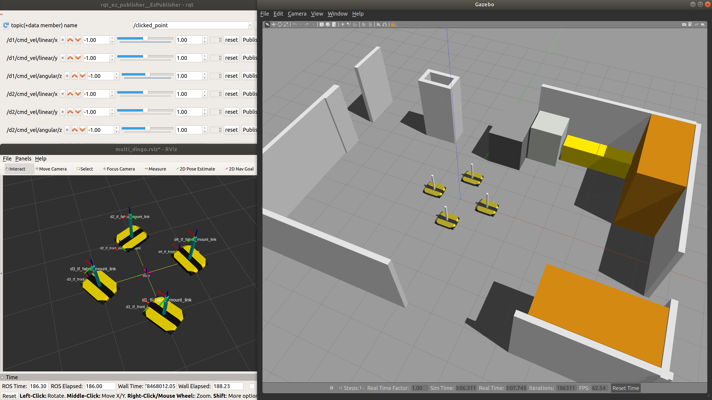

# Swarm Project - 2
This is a repository for ARM Swarm Project 2 that utilizes four omnidirectional Clearpath Dingo Robots.

#### Clearpath Dingo all repositories:
https://github.com/dingo-cpr

# The Devices In The Lab:

| Description             | Username      | Hostname (Computer Name) | IP            | Password  | OS           | ROS     |
| ---                     | ---           | ---                      | ---           | ---       | ---          | ---     |
| Pendant Tablet          | tablet        | tablet18                 | 192.168.1.99  | 1234      | Ubuntu 18.04 | Melodic  |
| Main Computer           | razer         | razer-18                 | 192.168.1.100 | 1234      | Ubuntu 18.04 | Melodic |
| Robot 1 (Color)         | administrator | cpr-do100-10000050       | 192.168.1.101 | cleatpath | Ubuntu 20.04 | Noetic |
| Robot 2 (Color)         | administrator | cpr-do100-10000051       | 192.168.1.102 | cleatpath | Ubuntu 20.04 | Noetic |
| Robot 3 (Color)         | administrator | cpr-do100-10000052       | 192.168.1.103 | cleatpath | Ubuntu 20.04 | Noetic |
| Robot 4 (Color)         | administrator | cpr-do100-10000053       | 192.168.1.104 | cleatpath | Ubuntu 20.04 | Noetic |

# Setting up the system

Simply run
```
./TODO
```
<details> 
    <summary>Click to expand</summary>

## Install some dependencies of Dingo Gazebo Simulation and Others
``` bash
sudo apt-get install ros-melodic-lms1xx # ROS driver for the SICK LMS1xx line of LIDARs.
sudo apt-get install ros-melodic-velodyne-simulator # Metapackage of Velodyne LIDAR simulation component
sudo apt-get install ros-melodic-hector-gazebo-plugins
sudo apt-get install ros-melodic-ridgeback-gazebo-plugins
sudo apt-get install ros-melodic-interactive-marker-twist-server
sudo apt-get install ros-melodic-ridgeback-control
sudo apt-get install ros-melodic-rqt-ez-publisher

sudo apt-get install spacenavd
sudo apt-get install ros-melodic-spacenav-node
sudo apt-get install ros-melodic-twist-mux
sudo apt-get install ros-melodic-robot-localization;
sudo apt-get install ros-melodic-microstrain-inertial-driver;
sudo apt-get install ros-melodic-microstrain-inertial-rqt;
sudo apt-get install ros-melodic-tf2-sensor-msgs;
sudo apt-get install ros-melodic-imu-tools;
sudo apt-get install ros-melodic-imu-pipeline; # for imu_transformer
```

## Building Steps
``` bash
cd;
mkdir catkin_ws_swarm2;
cd catkin_ws_swarm2;
rm -rf {*,.*};

git clone https://github.com/burakaksoy/Swarm-Robotics-2.git .;
cd src;
git clone -b melodic-devel https://github.com/burakaksoy/dingo.git;
git clone https://github.com/burakaksoy/dingo_simulator.git;
git clone https://github.com/burakaksoy/dingo_desktop.git;
git clone https://github.com/burakaksoy/AssistiveRobot-SimulationFiles.git;
git clone https://github.com/burakaksoy/RVizMeshVisualizer.git;
git clone https://github.com/burakaksoy/uwb_gazebo_plugin;

cd ..;
catkin_make -DCMAKE_BUILD_TYPE=Release;
source devel/setup.bash;
```


### In your `~/.bashrc` file, add these:
``` bash
source ~/catkin_ws_swarm2/devel/setup.bash

export GAZEBO_MODEL_PATH=~/catkin_ws_swarm2/src/AssistiveRobot-SimulationFiles/lab_gazebo/models
export GAZEBO_RESOURCE_PATH=~/catkin_ws_swarm2/src/AssistiveRobot-SimulationFiles/lab_gazebo/worlds
```

</details> 

# Steps for Gazebo Simulation of Single Dingo-O robot
<details> 
    <summary>Click to expand</summary>

Assuming that you already did the dependancy installations and building in [**Setting up the system**](#setting-up-the-system) section.

(Reference: http://www.clearpathrobotics.com/assets/guides/melodic/dingo/simulation.html)
## Running the simulation
### Gazebo simulation:
``` bash
roslaunch dingo_gazebo empty_world.launch x:=0. y:=0. yaw:=0. config:=front_laser
```
For other config options see: https://github.com/dingo-cpr/dingo/tree/melodic-devel/dingo_description
and create a config file in `.../dingo/dingo_description/urdf/configs/`

Another option for configurations is export their environment variables. For example:
``` bash
export DINGO_OMNI=1
export DINGO_LASER=1
export DINGO_LASER_MODEL='ust10' # or 'lms1xx'
export DINGO_IMU_MICROSTRAIN=1
roslaunch dingo_gazebo empty_world.launch x:=1. y:=0. yaw:=0.
```

### Corresponding RVIZ:
``` bash
roslaunch dingo_viz view_robot.launch
```

### To send simple velocity commands to the robot you can use rqt_ez_publisher:
``` bash
rosrun rqt_ez_publisher rqt_ez_publisher
```
and send messages to `\cmd_vel` topic.

</details> 

# Steps for Gazebo Simulation of Multiple Dingo-O robots

<details>
    <summary>Click to expand</summary>

Assuming that you already did the dependancy installations and building in [**Setting up the system**](#setting-up-the-system) section.

## Running the simulation in Empty World
This command launches the corresponding RVIZ and the rqt_ez_publisher all together. 
``` bash
roslaunch dingo_gazebo empty_world_multi.launch
```
Note that RVIZ TF frames are reported by `robot_localization` package that uses the _odometry_ and _IMU_ information, hence drifts after a while, but it is more realistic in that sense.
<!-- TODO: ADD image here -->


## Running the simulation in CII 8th Floor Lab
This is an example lab environment to visualize the scales of Dingo robots.
This command launches the corresponding RVIZ and the rqt_ez_publisher all together in CII 8th floor lab.
``` bash
roslaunch dingo_gazebo empty_lab_multi.launch
```
Note that RVIZ TF frames are reported by `robot_localization` package that uses the _odometry_ and _IMU_ information, hence drifts after a while, but more realistic.
<!-- TODO: ADD image here -->


## Running the simulation in Empty World with ground truth
This command launches the simulation with ground truth reported TF frames to RVIZ. Again, launching the corresponding RVIZ and the rqt_ez_publisher is embedded all together. 
``` bash
roslaunch dingo_gazebo empty_world_multi_ground_truth.launch
```
Note that RVIZ TF frames are reported by `message_to_tf` package that uses the _ground truth_ data coming from `gazebo_ros_p3d` plugin, hence it is exact representation of the Gazebo World.
Therefore, this command does not launch the Gazebo client GUI to save computational power, but could be re-enabled with gui parameter set to true in the launch file.
<!-- TODO: ADD image here -->


## Running the simulation in Demonstration Floor - Highbay

This command launches the corresponding RVIZ and the rqt_ez_publisher all together. 
``` bash
roslaunch dingo_gazebo empty_highbay_multi.launch
```
Note that RVIZ TF frames are reported by `robot_localization` package that uses the _odometry_ and _IMU_ information, hence drifts after a while, but it is more realistic in that sense.
<!-- TODO: ADD image here -->


For a simulation that includes the representative workstations and the workers run:
``` bash
roslaunch dingo_gazebo highbay_multi.launch
```


## Running the simulation in Demonstration Floor - Highbay with ground truth
This command launches the simulation with ground truth reported TF frames to RVIZ. Again, launching the corresponding RVIZ and the rqt_ez_publisher is embedded all together. 
``` bash
roslaunch swarm2_launch multi_dingo_sim_with_rviz_and_ez_publisher_highbay.launch
```
Note that RVIZ TF frames are reported by `message_to_tf` package that uses the _ground truth_ data coming from `gazebo_ros_p3d` plugin, hence it is exact representation of the Gazebo World.
Therefore, this command does not launch the Gazebo client GUI to save computational power, but could be re-enabled with gui parameter set to true in the launch file.
<!-- TODO: ADD image here -->

**Note that above, the world in Gazebo is visualized at RViz! This is only a static image of the world exported as a COLLADA (.dae) file and imported to RViz using [`RVizMeshVisualizer`](https://github.com/burakaksoy/RVizMeshVisualizer). If you make changes to the world file, update the mesh file following the steps in [here](https://github.com/burakaksoy/AssistiveRobot-SimulationFiles/tree/master/lab_gazebo#to-export-world-files-to-a-single-collada-dea).**
**For example, for the Highbay world, if you have already did the installation steps in the link above, run:**
``` bash
cd ~/catkin_ws_swarm2/src/AssistiveRobot-SimulationFiles/lab_gazebo/worlds;
ign gazebo -v 4 -s -r --iterations 1 highbay_swarm.world
```
**This will update the mesh file corresponding to the `highbay_swarm.world`.**


## Running the simulation in Anchor Industries Representative Plant Floor

**!!!IN PROGRESS, NOT DONE YET!!!**

This command launches the corresponding RVIZ and the rqt_ez_publisher all together. 
``` bash
roslaunch dingo_gazebo plant_floor_multi.launch
```
Note that RVIZ TF frames are reported by `robot_localization` package that uses the _odometry_ and _IMU_ information, hence drifts after a while, but it is more realistic in that sense.
<!-- TODO: ADD image here -->

</details>

# Physical UWB setup
<details> 
    <summary>Click to expand</summary>
    
## Related websites for the Qorvo (DecaWave) UWB module documents
DW1000 [https://www.qorvo.com/products/p/DW1000#documents](https://www.qorvo.com/products/p/DW1000#documents)

DW1001C [https://www.qorvo.com/products/p/DWM1001C#documents](https://www.qorvo.com/products/p/DWM1001C#documents)

DWM1001-DEV [https://www.qorvo.com/products/p/DWM1001-DEV#documents](https://www.qorvo.com/products/p/DWM1001-DEV#documents)

MDEK1001 [https://www.qorvo.com/products/p/MDEK1001#documents](https://www.qorvo.com/products/p/MDEK1001#documents)


## Download the Android DRTLS phone app

[https://www.qorvo.com/products/p/MDEK1001#documents](https://www.qorvo.com/products/p/MDEK1001#documents)

Download DRTLS App : Android Application APK

## Calibration Script
Used to determine the every module's (tags and anchors) offsets based on [this white paper with name: Antenna Delay Calibration of DW1000-Based Products and Systems (Application Note APS014)](https://www.qorvo.com/products/d/da008449).

Set 4 of them an on a nice square with best possible known manual position measurements. 

(3 of them gives only one solution, 4 of them gives a Least Squares solution with RMSE error to have an idea of how accurate the calculated offsets are.)

Take note of the manually measured distances, they are needed in the calibration script.

From the android app, put all the modules in the same network and set them as anchors. From the powered ones, only one of them must be set as initiator.

Use `antenna_offset_finding.m` MATLAB script in `uwb_matlab_scripts/` directory of this repo to find the offsets of each UWB module. Then set the offsets in `antenna_calibration.yaml` in `src/swarm_launch/config/` folder. Comments of the script should be sufficient to guide you for further details. 

Note: This script would work on Windows 10 but not in Windows 11 as of writing this document. See details [here](https://www.mathworks.com/matlabcentral/answers/1912280-bluetooth-scanning-error-in-windows-11-solutions#answer_1173820)

This script uses the BLE interface of the firmware to communicate with the tags. For further information see section 7 of [DWM1001 Firmware API Guide](https://www.qorvo.com/products/d/da007975)

After the calibration is done, set modules back as tags those you won't to use as anchors from the Android app.

## Script to Calculate and Write the Anchor positions into the Modules
Mount the UWB anchors in the (high bay) area. Measure the distances between them with a laser distance meter. 
Use `truck_bay_uwb_locations.m`  MATLAB script in `uwb_matlab_scripts/` directory of this repo. Comments of the script should be sufficient to guide you for further details.

Note: This script would work on Windows 10 but not in Windows 11 as of writing this document. See details [here](https://www.mathworks.com/matlabcentral/answers/1912280-bluetooth-scanning-error-in-windows-11-solutions#answer_1173820)

This script uses the BLE interface of the firmware to communicate with the tags. For further information see section 7 of [DWM1001 Firmware API Guide](https://www.qorvo.com/products/d/da007975)
    
</details>


# Tablet OS Setup
<details> 
    <summary>Click to expand</summary>

## Steps to install Ubuntu (20.04 or 18.04) on Surface Go 2 Tablet

Requires a USB-C to USB-A adapter and flash drive

1. Update Windows 10/11 using Settings -> Updates
2. Download and create Ubuntu 20.04 amd64 USB install drive
3. Disable Windows bitlocker and reboot. If it says “waiting to active”, finish activation, then disable: https://www.isunshare.com/windows-10/4-ways-to-remove-or-disable-bitlocker-encryption-on-windows-10.html 
4. Shrink the Windows 10 partition using Windows disk manager: https://www.tenforums.com/tutorials/96288-shrink-volume-partition-windows-10-a.html Suggested to shrink by 64000 MB
5. Connect bootable USB drive and reboot using advanced startup options: https://www.digitalcitizen.life/boot-your-windows-10-pc-usb-flash-drive The bootable usb drive may have the title “Linpus Lite”
6. Install Ubuntu as normal
7. Remove the USB drive
8. At this point Ubuntu is installed, but will not boot automatically. Do the advanced startup options again, and select “ubuntu”. This will boot into Ubuntu.
Follow these instructions in Ubuntu to disable Windows boot: https://www.reddit.com/r/SurfaceLinux/comments/egds33/possible_fix_for_booting_directly_to_grub_on/ Windows can still be booted using Grub menu
Ubuntu should now boot. The post is copied here for convenience:
    ```
        Possible fix for booting directly to grub on Surface Go
        If you're having trouble getting your Surface Go to boot to grub instead of the Windows Boot Manager, I might have something to try if you're brave: I moved the Microsoft folder in /boot/efi/EFI out of the way (In Ubuntu: sudo mv /boot/efi/EFI/Microsoft /boot/efi/EFI/Microsoft.bak) and now grub is loaded by default. I'd really only recommend this if you:

        Have a Windows USB recovery made and you know it's bootable

        Have your files backed up off the SSD (both Linux and Windows (if you care))

        Feel comfortable screwing around fixing a potentially broken EFI partition

        Aren't the sort of person who blames other people when you break your own computer following instructions you found on the Internet!

        All that said, it works for me on my recently purchased 8GB/128GB Surface Go w/ Ubuntu 19.10. I had already dumped the WIndows partition though, so I never tested whether grub had any issues loading Windows. You may also need to mess around with efibootmgr to fix the boot order, but I'm not sure.
    ```
9. You may also need to disable secure boot. This is achived from the BIOS settings. To enter the BIOS settings, while powering up the tablet, Press and hold the volume-up button on your Surface and at the same time, press and release the power button. When you see the Surface logo, release the volume-up button.
The UEFI menu will display within a few seconds.

</details>
